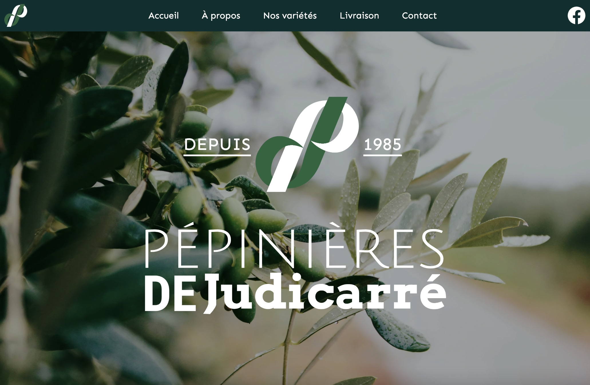

# Pépinières de Judicarré

Website developed for Pépinières de Judicarré, a plant nursery based in Brittany, France.

🌐 **Live website:** https://www.pepinieresdejudicarre.com/

## About the project

The goal was to create a modern and responsive website presenting the nursery, its products and services, while providing a simple and clear experience for visitors.

I worked on the frontend development, responsive implementation and deployment of the website.

## Tech stack

- Next.js
- React
- JavaScript
- Tailwind CSS
- Jest
- Vercel

## Key features

- Responsive website for desktop and mobile
- Reusable React components
- Multi-page navigation
- Custom styling with Tailwind CSS
- Connection to a separate backend
- Production deployment

## Project structure

`components/` — reusable UI components  
`pages/` — application routes  
`styles/` — global and component styling  
`public/` — static assets

## What I learned

This project gave me experience building and deploying a complete website for a real business, from frontend structure to production deployment.
